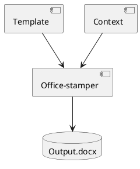

TL;DR: Keep your Word documents honest by generating diagrams from source and stamping them at build time. Use PlantUML or Mermaid to produce images, then let Office‑stamper inject them into `.docx` so reports stay versioned, reproducible, and automation‑friendly.

## Quick Facts

| Aspect     | Details                                              |
|------------|------------------------------------------------------|
| Generators | PlantUML (Graphviz), Mermaid                         |
| Output     | PNG/SVG generated during build, stamped into Word    |
| Tooling    | Office‑stamper (Java), Maven/Gradle task, CI runner  |
| Best for   | Architecture reviews, audits, proposals, living docs |

---

## Why diagrams as code?

Traditional drag‑and‑drop tools are comfortable but don’t scale. By switching to text‑based generation, you get:

- Version control: diagram sources live in Git with your code.
- Live generation: images are recreated during builds and in CI.
- Automation: zero manual syncing between Word and architecture diagrams.

This is especially useful for proposals, audit reports, and architecture overviews where you need trustworthy diagrams synchronized with the real system state.

---

## PlantUML vs Mermaid (quick taxonomy)

- Use Mermaid for quick, readable diagrams and browser‑native rendering.
- Switch to PlantUML when you need:
  - complex component/class diagrams
  - sequence diagrams with detailed notes
  - skinparams/themes and broader UML coverage

I routinely mix both: keep simple flows in Mermaid; use PlantUML for architecture.

---

## Minimal wiring in Java (Office‑stamper)

PlantUML’s headless CLI and Office‑stamper’s image resolver let you pull in generated diagrams directly into Word templates:

```java
import java.nio.file.Paths;
import java.util.Map;
import com.github.officestamper.OfficeStamperConfigurations;
import com.github.officestamper.Resolvers;
import com.github.officestamper.image.Image;

public class DiagramStampingExample {
  public void run() {
    var configuration = OfficeStamperConfigurations.standardWithPreprocessing()
        .addResolver(Resolvers.image());

    // In your template: ${diagram}
    var context = Map.of(
        "diagram",
        new Image(Paths.get("assets/context.png"))
    );

    stamper.stamp(template, context, output);
  }
}
```

If the architecture or sequence changes, the image regenerates, and your document stays right—no manual updates.

---

## Build integration (Maven example)

Generate diagrams before stamping the Word template.

```xml
<!-- pom.xml excerpt -->
<plugin>
  <groupId>org.codehaus.mojo</groupId>
  <artifactId>exec-maven-plugin</artifactId>
  <version>3.1.0</version>
  <executions>
    <execution>
      <id>plantuml-generate</id>
      <phase>generate-resources</phase>
      <goals><goal>java</goal></goals>
      <configuration>
        <mainClass>net.sourceforge.plantuml.Run</mainClass>
        <arguments>
          <argument>-tpng</argument>
          <argument>-o</argument>
          <argument>${project.build.directory}/diagrams</argument>
          <argument>${project.basedir}/src/diagrams</argument>
        </arguments>
        <systemProperties>
          <systemProperty>
            <key>GRAPHVIZ_DOT</key>
            <value>${env.DOT}</value>
          </systemProperty>
        </systemProperties>
      </configuration>
    </execution>
  </executions>
  <dependencies>
    <dependency>
      <groupId>net.sourceforge.plantuml</groupId>
      <artifactId>plantuml</artifactId>
      <version>1.2023.13</version>
    </dependency>
  </dependencies>
</plugin>
```

Wire your stamping step after diagrams exist (e.g., during `package`), pointing template variables to the generated files under `target/diagrams`.

---

## Run‑of‑show (authoring workflow)

1. Write the diagram source (`.puml` or Markdown block with Mermaid).
2. Generate images locally (PlantUML CLI or Mermaid CLI).
3. Reference image paths from your Word template using `${variable}` placeholders.
4. Stamp with Office‑stamper in your build.
5. Verify output locally; commit sources and let CI recreate artifacts.

---

## Troubleshooting and sharp edges

- Graphviz missing: PlantUML needs `dot`. Install and set `GRAPHVIZ_DOT` or use the packaged version.
- Fonts and icons: ensure required fonts are available in CI to avoid layout shifts.
- Image size/DPI: prefer SVG when possible; otherwise set a consistent width in the template.
- Paths: generate into the build directory and use relative paths from the stamping process.
- Mermaid in CI: use `@mermaid-js/mermaid-cli` in a Node step, pin the version for stability.

---

## Production checklist

- [ ] Diagram sources tracked in Git (reviewable in PRs)
- [ ] Reproducible build step generates images
- [ ] Word template references variables (no hardcoded file paths)
- [ ] Stamping wired into CI (fail fast on missing images)
- [ ] Style/theme consolidated (PlantUML `skinparam` or Mermaid config)
- [ ] Representative example embedded in a published report

---

## Example: live diagram block

Below is a small PlantUML component diagram you can generate at build time; the stamped document will embed the resulting image.



---

## Conclusion

Treating diagrams as code turns documentation into a repeatable pipeline. Generate images from text, stamp them into Word at build time, and your reports will remain accurate without manual syncing.
