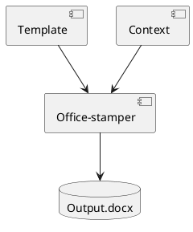

In enterprise documentation workflows, I've adopted a *diagrams as code* approach using **Office-stamper** in combination with diagram generators like **PlantUML** and **Mermaid**. This method lets me build dynamic Word documents with generated visuals that live alongside the codebase, with the same versioning, traceability, and automation benefits that we expect from source code.

---

### Why Diagrams as Code?

Traditional diagram tools offer visual comfort but don't scale well for technical documentation. By switching to text-based diagram generation, I gain:

* **Version control**: All diagram sources are text-based and live in Git.
* **Live generation**: Diagrams are generated at build time directly from the repository.
* **Automation**: Documents can include visuals generated during CI/CD pipelines.

This is particularly useful for proposals, audit reports, and architecture overviews where I want to demonstrate real system structure — and keep diagrams synchronized with the actual codebase.

---

### PlantUML vs Mermaid

For quick or one-off diagrams, I prefer **Mermaid** because of its simplicity and browser-based rendering. But when the content needs:

* complex component diagrams
* sequence diagrams with detailed notes
* customizable themes and skinparams
* broader UML notation support

…then I switch to **PlantUML**.

PlantUML's headless CLI and Office-stamper's image resolver let me pull in generated diagrams directly into Word templates:
```java
var configuration = OfficeStamperConfigurations.standardWithPreprocessing()
.addResolver(Resolvers.image());

// In your template: ${diagram}
var context = Map.of("diagram",
new Image(Paths.get("assets/context.png")));

stamper.stamp(template, context, output);
```
This way, if the architecture changes, the diagram regenerates, and the document stays accurate without extra effort.

---

### Example: Live Diagrams in Reports

In a recent architecture review document, I embedded component diagrams generated by PlantUML and sequence diagrams from Mermaid. All of it was built during the Maven build process and stamped into the final `.docx` deliverable.

This created a consistent, trusted source of truth, and it reduced the risk of outdated diagrams slipping into final reports.

---

### A Developer-Oriented Workflow

Office-stamper + diagram generators let me work on documentation the same way I work on code:

* Commit messages tell the story of changes
* I can roll back, diff, and review diagram sources in pull requests
* Others can suggest improvements via merge requests
* CI pipelines validate and regenerate visuals automatically

---

### Conclusion

Treating diagrams as code is more than a formatting choice — it's a mindset that treats documentation and communication as first-class citizens of the software process.

If you're tired of syncing Word documents with architecture diagrams manually, this approach is worth exploring.

---

### Live diagram example (side-by-side)

Below is a small PlantUML component diagram generated at build time. The source is shown side-by-side with the generated image embedded in a Word document.


