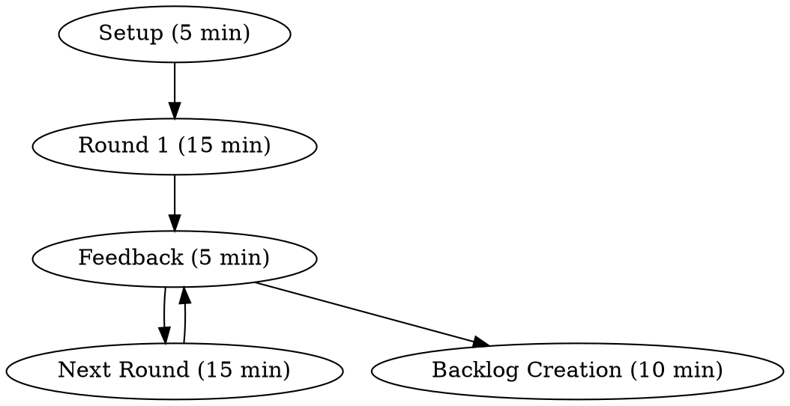

TL;DR: Can a new developer build, run, and test your project in under 4 hours using only a 240-character message? This
gamified workshop exposes onboarding documentation gaps through timed challenges—turning painful "where's the docs?"
conversations into an actionable improvement backlog.

A new contractor joins your team Monday morning. By lunch, they're still installing dependencies. By Wednesday, they're
Slacking you about environment variables. By Friday, they've made zero commits. Sound familiar? The problem isn't
talent—it's missing documentation. This workshop surfaces those gaps in 60 minutes through a simple challenge: can
someone set up your dev environment using only a 240-character starting message? If not, you've just found your next
sprint's documentation work.

## Workshop Quick Facts

| Aspect             | Details                                 |
|--------------------|-----------------------------------------|
| **Duration**       | 60–90 minutes (1–4 rounds)              |
| **Participants**   | 1 player + 2–6 observers                |
| **Setup**          | Blank computer or VM + 240-char message |
| **Output**         | Prioritized documentation backlog       |
| **Repeat cadence** | Every 1–2 months or when onboarding     |



## Why run it (Goal)

Highlight missing or rotting developer documentation by setting up the dev environment from a blank machine. If a
newcomer cannot get to build/run/tests within half a day, the issue is not talent—it's discoverability, environment
design, or both.

## Roles and Setup

- Player: 1 person executes the setup (newcomer or experienced dev).
- Observers: 2–6 people silently take notes, no hints.
- Facilitator: keeps time, enforces rules, drives the retro.

Environment: a reasonably blank machine (fresh VM, Codespace, or clean laptop).

Give the player exactly one starting message (max 240 characters). Nothing else.

## The 240-Character Rule

**Why the limit?**  
Forces you to link to *discoverable* documentation instead of institutional knowledge. If your starting message is "Ask
Sarah about the database," you've already failed.

**Good examples:**

- ✅ "Clone github.com/yourorg/app, open README.md, follow 'Quick Start'"
- ✅ "Join Slack #dev-setup channel, pin has devcontainer link + wiki URL"
- ✅ "Open Confluence: confluence.yourco.com/docs/APP → Dev Setup"

**Bad examples:**

- ❌ "Sarah knows the setup, DM her"
- ❌ "It's documented somewhere, check the wiki"
- ❌ "Run install.sh (ignore the errors, they're fine)"

## Run of Show (Rounds)

Run one to four rounds. A micro‑retro time‑boxes and follows each round.

1. Setup (5 min): read the 240‑char message, open links, start.
2. Round N (15 min): player advances toward build/run/tests. No questions.
3. Feedback (5 min): structured retro (see prompts below).
4. Backlog (10 min after the last round): consolidate action items, assign owners.

### Scoring Checklist (8 core points)

Each round, award 1 point for each achievement:

- [ ] **Build:** Package all codebases
- [ ] **Build (clean):** No compiler warnings
- [ ] **Run:** Player can interact with Application
- [ ] **Run (local):** Player can interact on his machine
- [ ] **Endpoints:** Found API/service catalog
- [ ] **Endpoints (test):** Successfully called at least one
- [ ] **Tests:** Automated test suite runs
- [ ] **Tests (clean):** No warnings or ignored tests

Bonus points (optional, +10 max):

- IDE setup documented (2 pts)
- Version requirements specified (2 pts)
- Architecture docs + living documentation (2 pts)
- CI/CD access instructions (2 pts)
- Observability/monitoring access (2 pts)

If any questions arise, the observing team shouldn’t give any more information, but can take notes or start drafting the
documentation they feel is missing.

### 5-Min Feedback (Structured Retro)

Use these prompts to keep feedback focused:

**What worked?**

- "Which documentation did the player actually use?"
- "Were any links/files particularly helpful?"

**What blocked progress?**

- "Where did the player get stuck the longest?"
- "What information did they search for but couldn't find?"

**What surprised you?**

- "Did the player follow a different path than expected?"
- "Were there undocumented assumptions?"

**Quick wins:**

- "What could we document in under 30 minutes?"

💡 **Tip:** Use a shared doc (Google Doc, Miro board) for live note-taking.

### Ending (Backlog Creation)

Create a prioritized backlog of the missing documentation needed to onboard a colleague, coach, or maintenance team. Add
these items immediately to your Jira board (or equivalent), with owners and due dates.

### Gamification (optional)

To compare teams or add energy, award points per checklist item each round. Publish a scoreboard over time.

## Example Workshop Run: E-Commerce Platform Team

**Round 1 (15 min)**

- **Message:** "Clone github.com/acme/shop-api, see README"
- **Player:** Found README, but it said "install Java" without version
- **Result:** Installed Java 21, project needs Java 17 → build failed
- **Score:** 0/8 points
- **Action items:** Add Java version + download link to README

**Round 2 (15 min)**

- **Message:** Same as Round 1
- **Player:** Built successfully, but `mvn test` skipped integration tests
- **Result:** Build works, tests run but incomplete
- **Score:** 4/8 points (build + build-clean + tests partial)
- **Action items:** Document how to run full test suite (with Docker deps)

**Round 3 (15 min)**

- **Message:** Same as Round 1
- **Player:** Everything worked! Found Swagger UI for endpoints
- **Score:** 8/8 points ✅
- **Outcome:** Team feels confident handing project to another squad

## How Mature Is Your Onboarding?

Use your workshop score to gauge maturity:

**Level 1: Broken (0–3 points)**  
Can't even build the project. Documentation likely doesn't exist or is severely outdated.  
🚨 **Action:** Stop feature work, invest a sprint in docs.

**Level 2: Fragile (4–6 points)**  
Builds work, but tests or runtime fail. Documentation exists but has gaps.  
⚠️ **Action:** Document missing prerequisites, add troubleshooting section.

**Level 3: Functional (7–10 points)**  
Core setup works. Some advanced features undocumented.  
✅ **Action:** Add IDE setup, CI/CD access, observability links.

**Level 4: Excellent (11–15 points)**  
Everything documented and discoverable. New devs productive in hours.  
🎯 **Action:** Maintain and update quarterly.

**Level 5: Automated (16+ points + automation)**  
One-command setup via devcontainer, Nix, or similar. Self-service everything.  
🚀 **Action:** Share your setup as a template for other teams.

## Common Gaps Discovered

Based on running this workshop with dozens of teams, here's what usually breaks:

| Problem                      | Symptom                       | Fix                                                   |
|------------------------------|-------------------------------|-------------------------------------------------------|
| **Version hell**             | "Works on my machine"         | Add `.sdkmanrc`, `.nvmrc`, or devcontainer            |
| **Secret sprawl**            | "Where do I get the API key?" | Document secrets bootstrap (1Password CLI, vault URL) |
| **Database drift**           | "My migrations fail"          | Provide seed data script or Docker Compose            |
| **IDE assumptions**          | "Just use IntelliJ settings"  | Document VS Code + IntelliJ setup separately          |
| **Test environment missing** | "Tests need AWS credentials"  | LocalStack/Testcontainers setup in README             |
| **Proxy/VPN required**       | "I can't reach the registry"  | Document network requirements upfront                 |

## Running the Workshop Successfully

### Before the workshop:

- **Prepare the machine:** VM snapshot, cloud workspace (GitHub Codespaces), or wiped laptop
- **Set expectations:** Tell the player they can't ask questions during timed rounds
- **Prepare observers:** Give them a note-taking template (see below)
- **Choose the right player:** Either a new team member (realistic) or an experienced dev (finds gaps faster)

### During the workshop:

- **Keep strict time:** Use a visible timer, no extensions
- **Record the session:** Screen recording helps identify navigation struggles
- **Take notes on *silence*:** When the player stalls, that's a documentation gap
- **Ban helpful hints:** Observers must stay quiet (hard but essential!)

### After the workshop:

- **Prioritize the backlog:** Fix quick wins immediately (same day if possible)
- **Assign owners:** Don't leave action items orphaned
- **Schedule next run:** Set a calendar reminder for 1–2 months out

## When Teams Push Back

**"We don't have time for workshops"**  
→ Response: "How much time did you spend last month helping new people set up?"

**"Our setup is too complex to document"**  
→ Response: "This workshop will show you exactly what to simplify."

**"We only onboard once a year"**  
→ Response: "Documentation rots. This keeps it fresh for contractors, coaches, and team transfers."

**"Our docs are fine, we don't need this"**  
→ Response: "Great! This will prove it and give you a maturity score to brag about."

## Copy‑paste Templates

### 1) Starting message (240 chars max)

> - Clone https://github.com/yourorg/yourapp, 
> - Open README.md,
> - Follow Quick Start.
> - If missing tools, see .tool-versions or devcontainer.json. 
> - Docs at https://wiki.yourco/yourapp/dev-setup

### 2) Observer notes (per round)

```
Round #: ___  Player: ___  Date: ___
Used docs/links:
- ...

Stuck points (timestamps):
- ...

Missing info we expected:
- ...

Quick wins (<30 min):
- ...
```

### 3) Scoring sheet (copy this in your retro doc)

```
[ ] Build
[ ] Build (clean)
[ ] Run
[ ] Run (local)
[ ] Endpoints discovered
[ ] Endpoint invoked
[ ] Tests run
[ ] Tests (clean)

Bonus (up to +10):
[ ] IDE setup (2)  
[ ] Versions specified (2)
[ ] Arch + living docs (2)
[ ] CI/CD access (2)
[ ] Observability access (2)
```

### 4) Backlog item template (Markdown)

```
Title: README – Specify Java version and install path
Context: Player installed Java 21, project requires Java 17.
Definition of Done:
- README shows required Java version and download link
- `sdkman`/`.tool-versions` added or devcontainer updated
- CI verifies version via build step
Owner: @alice  Due: 2023‑06‑15  Labels: onboarding, docs
```

### 5) Calendar reminder text

```
Subject: Rerun Onboarding Workshop – yourapp
Body: 60‑min rerun to keep docs fresh. Bring a clean VM. Use the same 240‑char message. Goal: reach level 3+.
```

## Conclusion

The best documentation is the documentation that gets used. This workshop forces you to experience onboarding from a
newcomer's perspective and turns insights into a concrete backlog. Run it once. Then look your next new hire in the eye
and say: "You'll be committing code by lunch."
