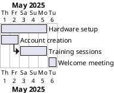
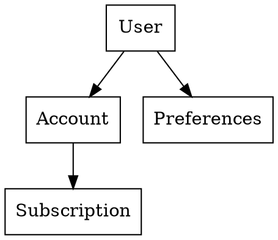

In several of my projects, I’ve integrated **Graphviz** and **PlantUML** into the development and documentation workflows. These tools allow diagrams to be described and stored in plain text format — a practice often referred to as *Diagrams as Code*.

While traditional tools like draw\.io or Visio are familiar and visual, they don’t scale well in collaborative environments. In contrast, diagram DSLs (domain-specific languages) make it possible to treat visuals like any other code artifact: version-controlled, diffable, and automation-friendly.

---

## Why Diagrams as Code?

There are a few recurring reasons why I now prefer this approach:

* **Maintainability**: When diagrams are stored as text, they can be edited quickly without manually repositioning elements.
* **Automation**: I integrate diagram generation into CI pipelines and IDE plugins to ensure documentation stays up to date.
* **Traceability**: Changes to diagrams are tracked in Git alongside the code they describe.
* **Developer proximity**: Keeping diagrams close to the code encourages developers to maintain them.

---

## Example: Gantt Diagram in PlantUML

In a recent internal IT project, we used a PlantUML Gantt diagram to track the onboarding process for new employees across multiple teams.

Here's a simplified snippet:

This short description produces a visual timeline we can embed in internal docs or onboarding pages. Because the source is plain text, it’s easy to adjust dates or durations — no dragging and resizing needed.

---

## Example: Class Diagram in Graphviz

In another project, we used Graphviz to quickly sketch out the core relationships of a Java domain model before starting implementation.

This quick sketch helped align the team during sprint planning, and the DOT file was committed next to the design document. As the domain evolved, we updated the graph just like any other source file.

---

## Team Adoption

Initial reactions to text-based diagramming were mixed. Some team members were hesitant due to the unfamiliar syntax. But over time, most appreciated the gains:

* Easy to grep/search in a large codebase
* Merge conflicts are easier to handle than binary diagram formats
* Enables “documentation as living code,” rather than a separate, neglected deliverable

---

## Conclusion

Diagrams as Code improve clarity without adding friction. Whether you’re working on architecture, onboarding workflows, or software design, they offer a sustainable way to document and communicate structure.

If your team struggles to keep documentation aligned with implementation, this approach may be worth adopting — even gradually.
