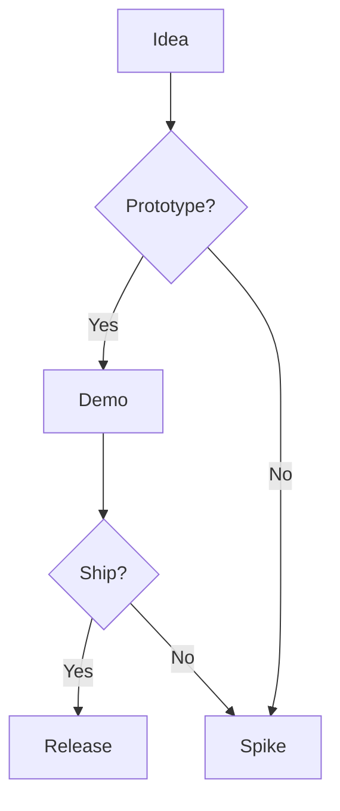

I build my talks and workshops as code. The slides live in Git, are reproducible on any machine, and are published from CI with the exact same toolchain I run locally. The source for my decks is public:

- Repository: https://github.com/caring-coder/presentations

This post documents the approach and shows a concrete `pom.xml` I use to compile AsciiDoc into a Reveal.js deck, with diagrams rendered at build time.

### Abstract

- Authoring format: AsciiDoc (AsciidoctorJ)
- Slide engine: Reveal.js
- Build tool: Maven, fully reproducible, downloads its own dependencies (JRuby, gems, Reveal.js)
- Extras: `asciidoctor-diagram` for PlantUML/Graphviz and friends; include tagged source code from the repo

### Slide deck source and layout

I keep each presentation as an isolated Maven module or folder under the repo. The typical layout is:

```
<deck-name>/
  pom.xml
  src/docs/asciidoc/
    index.adoc       # entrypoint
    images/          # generated or static assets
    fragments/*.adoc # reusable sections
docs/                # real code samples to include via tags (optional)
```

AsciiDoc gives me strong authoring primitives (includes, conditionals, attributes) and lets me pull real, compilable code straight into slides with tagged regions:

```adoc
[source,java]
----
include::../../docs/src/main/java/com/example/Thing.java[tags=demo]
----
```

When the implementation changes, the slides change with it.

### Build: Maven + Asciidoctor Reveal.js

The Maven build downloads Reveal.js, provisions gems, enables `asciidoctor-diagram`, and emits HTML into `target/generated-slides`. Here is a representative `pom.xml` I use in those presentation modules:

```xml
<?xml version="1.0" encoding="UTF-8"?>
<project xmlns="http://maven.apache.org/POM/4.0.0" xmlns:xsi="http://www.w3.org/2001/XMLSchema-instance"
         xsi:schemaLocation="http://maven.apache.org/POM/4.0.0 http://maven.apache.org/xsd/maven-4.0.0.xsd">
    <modelVersion>4.0.0</modelVersion>
    <groupId>pro.verron</groupId>
    <artifactId>diagram-as-code</artifactId>
    <version>1.0.0-SNAPSHOT</version>
    <name>Diagram as Code</name>
    <description>A presentation about diagram-as-code tools.</description>

    <properties>
        <project.slides.directory>${project.build.directory}/generated-slides</project.slides.directory>
        <project.build.sourceEncoding>UTF-8</project.build.sourceEncoding>
        <maven.compiler.source>1.8</maven.compiler.source>
        <maven.compiler.target>1.8</maven.compiler.target>
        <asciidoctor.maven.plugin.version>3.2.0</asciidoctor.maven.plugin.version>
        <asciidoctorj.version>3.0.0</asciidoctorj.version>
        <asciidoctorj.diagram.version>3.0.1</asciidoctorj.diagram.version>
        <jruby.version>10.0.2.0</jruby.version>
        <revealjs.version>3.9.2</revealjs.version>
        <!-- Use 'master' as version and remove the 'v' prefixing the download url to use the current snapshot version  -->
        <asciidoctor-revealjs.version>master</asciidoctor-revealjs.version>
    </properties>

    <dependencies>
        <dependency>
            <groupId>rubygems</groupId>
            <artifactId>asciidoctor-revealjs</artifactId>
            <version>4.0.1</version>
            <type>gem</type>
        </dependency>
    </dependencies>

    <build>
        <defaultGoal>process-resources</defaultGoal>
        <extensions>
            <extension>
                <!-- this allows us to download gems -->
                <groupId>org.torquebox.mojo</groupId>
                <artifactId>mavengem-wagon</artifactId>
                <version>1.0.3</version>
            </extension>
        </extensions>
        <plugins>
            <plugin>
                <groupId>com.googlecode.maven-download-plugin</groupId>
                <artifactId>download-maven-plugin</artifactId>
                <version>1.13.0</version>
                <executions>
                    <execution>
                        <id>install-revealjs</id>
                        <phase>generate-resources</phase>
                        <goals>
                            <goal>wget</goal>
                        </goals>
                        <configuration>
                            <url>https://github.com/hakimel/reveal.js/archive/${revealjs.version}.zip</url>
                            <unpack>true</unpack>
                            <outputFileName>reveal.js-${revealjs.version}.zip</outputFileName>
                            <outputDirectory>${project.slides.directory}</outputDirectory>
                        </configuration>
                    </execution>
                </executions>
            </plugin>
            <plugin>
                <groupId>de.saumya.mojo</groupId>
                <artifactId>gem-maven-plugin</artifactId>
                <version>2.0.1</version>
                <configuration>
                    <jrubyVersion>${jruby.version}</jrubyVersion>
                    <gemHome>${project.build.directory}/gems</gemHome>
                    <gemPath>${project.build.directory}/gems</gemPath>
                </configuration>
                <executions>
                    <execution>
                        <id>install-gems</id>
                        <goals>
                            <goal>initialize</goal>
                        </goals>
                        <phase>initialize</phase>
                    </execution>
                </executions>
            </plugin>
            <plugin>
                <groupId>org.asciidoctor</groupId>
                <artifactId>asciidoctor-maven-plugin</artifactId>
                <version>${asciidoctor.maven.plugin.version}</version>
                <dependencies>
                    <!-- Comment this section to use the default jruby artifact provided by the plugin -->
                    <dependency>
                        <groupId>org.jruby</groupId>
                        <artifactId>jruby-complete</artifactId>
                        <version>${jruby.version}</version>
                    </dependency>
                    <!-- Comment this section to use the default AsciidoctorJ artifact provided by the plugin -->
                    <dependency>
                        <groupId>org.asciidoctor</groupId>
                        <artifactId>asciidoctorj</artifactId>
                        <version>${asciidoctorj.version}</version>
                    </dependency>
                    <dependency>
                        <groupId>org.asciidoctor</groupId>
                        <artifactId>asciidoctorj-diagram</artifactId>
                        <version>${asciidoctorj.diagram.version}</version>
                    </dependency>
                    <dependency>
                        <groupId>fr.jmini.asciidoctorj</groupId>
                        <artifactId>sourcedir</artifactId>
                        <version>1.1.0</version>
                    </dependency>
                </dependencies>
                <configuration>
                    <requires>
                        <require>asciidoctor-diagram</require>
                    </requires>
                    <sourceDirectory>src/docs/asciidoc</sourceDirectory>
                    <attributes>
                        <sourcedir-definition>${project.basedir}/docs</sourcedir-definition>
                    </attributes>
                </configuration>
                <executions>
                    <execution>
                        <id>generate-slides</id>
                        <phase>process-resources</phase>
                        <goals>
                            <goal>process-asciidoc</goal>
                        </goals>
                        <configuration>
                            <gemPath>${project.build.directory}/gems</gemPath>
                            <requires>
                                <require>asciidoctor-revealjs</require>
                                <require>asciidoctor-diagram</require>
                            </requires>
                            <outputDirectory>${project.slides.directory}</outputDirectory>
                            <backend>revealjs</backend>
                            <attributes>
                                <revealjsdir>reveal.js-${revealjs.version}</revealjsdir>
                                <revealjs_theme>serif</revealjs_theme>
                                <revealjs_transition>linear</revealjs_transition>
                                <project-version>${project.version}</project-version>
                            </attributes>
                        </configuration>
                    </execution>
                </executions>
            </plugin>
        </plugins>
    </build>

    <repositories>
        <repository>
            <id>mavengems</id>
            <url>mavengem:https://rubygems.org</url>
        </repository>
    </repositories>

</project>
```

With this configuration, a simple `mvn clean package` produces HTML slides in `target/generated-slides`. Open the generated `index.html` (or the name of your `index.adoc` output) directly in a browser, or serve the folder via any static file server.

### Authoring: slides, code, and diagrams

- Source includes: I prefer tagging production-like examples and reusing them in slides via `include::`.
- Diagrams: `asciidoctor-diagram` renders PlantUML, Mermaid (via Kroki), Graphviz, and more at build time. This is a practical application of the [Diagrams as Code](/documentation-as-code/2023/09/01/diagram-as-code.html) philosophy: the diagrams are version-controlled, diffable, and stay in sync with the slide narrative.

Example:

**PlantUML**
```plantuml
Alice -> Bob: request
Bob --> Alice: response
```

**Mermaid**


If your diagrams require native tools (e.g., Graphviz), install them locally or route rendering through Kroki.

### Local run and CI

- Prerequisites: Java 17+ and Maven. JRuby and gems are provisioned by the build; no system Ruby is required.
- Build locally: `mvn clean package` then open `target/generated-slides/*.html`.
- CI publishing: copy the `generated-slides` folder to GitHub Pages (I use a simple deploy step per deck) so attendees always see the version tied to a tag.

### Troubleshooting

- If Reveal.js assets don’t load, ensure the archive was downloaded into `target/generated-slides/` and the `revealjsdir` attribute matches the folder name.
- For diagram failures, check that `asciidoctor-diagram` is required and that any native dependencies (like Graphviz) are installed or that Kroki is enabled.

### References

- Presentations repo: https://github.com/caring-coder/presentations
- Asciidoctor Maven Plugin: https://github.com/asciidoctor/asciidoctor-maven-plugin
- Asciidoctor Reveal.js: https://github.com/asciidoctor/asciidoctor-reveal.js
- Asciidoctor Diagram: https://github.com/asciidoctor/asciidoctor-diagram
