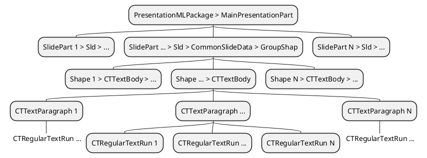

PPTX stamping was added as a bounded adapter, proving the engine scales to a new format without touching the core.

Commit: [`b748e83`](https://github.com/verronpro/office-stamper/commit/b748e83)

I had a punctual need in my new team at EDF China: stamp data into PowerPoint decks and repeat slides for each element of a collection. It made me eager to  apply the exact same mental model we use for Word. Instead of bolting format logic into the core, I treated PPTX as an adapter at the edges and used this as a test of the engine's design: placeholders → resolvers → traversal/execution.

The goal was not feature parity; it was to prove that the abstractions hold. If the model is right, new formats plug in cleanly, and the engine remains pure.

## What changed (at a glance)

- New bounded adapter for PPTX:
  - `PowerpointVisitor` (typed traversal), `PowerpointCollector` (gather paragraphs), `PowerpointParagraph` and `PowerpointRun` (text run aggregation), and `PowerpointStamper` (end‑to‑end stamping pipeline).
  - A convenience preset: `OfficeStampers.pptxStamper()`.
- Small but important interface evolution: `Paragraph` became generic (`Paragraph<T>`), enabling a uniform replacement contract while allowing format‑specific run types.
- A quick characterization test (`BasicPowerpointTest`) exercises the golden path: evaluate SpEL against a context and replace placeholders while preserving styles.

## Design deep dive — Keep the core clean, push format logic to the edges.

The heart of the change is that PPTX traversal and text operations live in a dedicated adapter layer. The engine's “language” remains unchanged: find placeholders, evaluate, replace; do so over paragraphs/runs that might be split arbitrarily by the authoring tool.

### Traversal seam (PlantUML)



The visitor walks the presentation structure and collects `CTTextParagraph` nodes. Paragraphs are wrapped in `PowerpointParagraph`, which aggregates runs and provides the same operations we use on DOCX paragraphs.

### The minimal engine contract — now generic

Small, surgical interface change that unlocks a clean adapter:

```diff
- public interface Paragraph {
-     void replace(Placeholder placeholder, R replacement);
-     String asString();
- }
+ public interface Paragraph<T> {
+     void replace(Placeholder placeholder, T replacement);
+     String asString();
+ }
```

- DOCX side: `StandardParagraph implements Paragraph<R>` (where `R` is `org.docx4j.wml.R`).
- PPTX side: `PowerpointParagraph implements Paragraph<CTRegularTextRun>`.

The engine stays format‑agnostic while each adapter chooses its native run representation.

### Style preservation is non‑negotiable

Replacing text must keep typography intact. The adapter copies the original run/paragraph style to the replacement run:

```java
// Example from the PPTX adapter
replacement.setRPr(firstRun.run().getRPr()); // keep per-run style

// Also apply paragraph default style when creating new runs
private static void applyParagraphStyle(CTTextParagraph p, CTRegularTextRun run) {
    var properties = p.getPPr();
    if (properties == null) return;
    var defaults = properties.getDefRPr();
    if (defaults == null) return;
    run.setRPr(apply(defaults)); // copy relevant character properties
}
```

This mirrors the DOCX implementation and ensures that replacing a placeholder does not visually “blink” the slide.

---

### Copy‑paste‑ready example — Stamp a title and a bullet

```java
import org.docx4j.openpackaging.packages.PresentationMLPackage;
import pro.verron.docxstamper.preset.OfficeStampers;

import java.io.InputStream;
import java.io.OutputStream;
import java.nio.file.Files;
import java.nio.file.Path;

public class PptxStampingExample {
  record Person(String name) {}

  public static void main(String[] args) throws Exception {
    // 1) Load a base template deck with placeholders like "#{name}" in title/bullet
    Path template = Path.of("test", "sources", "powerpoint-base.pptx");
    try (InputStream in = Files.newInputStream(template)) {
      PresentationMLPackage pptx = PresentationMLPackage.load(in);

      // 2) Prepare context (evaluated via SpEL)
      Person ctx = new Person("Bart");

      // 3) Stamp
      var stamper = OfficeStampers.pptxStamper();
      try (OutputStream out = Files.newOutputStream(Path.of("out.pptx"))) {
        stamper.stamp(pptx, ctx, out);
      }
    }
  }
}
```

Slide authoring example (title + bullet):

```
Title: Hello
Bullet: #{name}
```

Expected stamped text:

```
Hello
Bart
```

Notes:
- Placeholders use the same SpEL syntax as DOCX. Any `ctx` fields/methods exposed to SpEL are usable in slides.
- The adapter aggregates split runs, so placeholders can span multiple runs without breaking replacement.

---

### Why this validates the model

- One interface tweak, many canvases: by making `Paragraph` generic, both DOCX and PPTX provide the same operations over native runs, keeping the engine unpolluted.
- Bounded adapter: PPTX traversal and mutations live behind the visitor/collector/paragraph classes. The core doesn’t know or care about `pptx4j`.
- Tests as truth: a single golden‑path test encodes behavior and guards against regressions while we iterate.

### Scope choice — text first, images later

This is intentionally a proof‑of‑concept focused on text placeholders (titles, bullets, notes). If needs grow, the next steps are clear:
- Add image and shape stamping through the same adapter seam.
- Expand characterization tests with realistic decks.
- If necessary, publish a simple defer list and selection criteria (signal‑to‑noise, demand).

No perf claims yet; when real decks appear, we'll profile and bound traversal to avoid quadratic edits.

---

### Risks and mitigations

- Feature skew between DOCX and PPTX: acceptable for now; document usage and expand as needs appear.
- Performance on media‑heavy decks: profile against real samples; cap traversal/mutations; keep run operations linear.
- API leakage: keep the engine domain pure; confine `pptx4j` types to the adapter and the `Paragraph<T>` instantiation.

---

### References

- Commit: [`b748e83`](https://github.com/verronpro/office-stamper/commit/b748e83)
- Related notes and examples (see `engine/src/site/asciidoc` in the repository).

---

### Thank you

If you're an advanced user or contributor evaluating extensibility: feedback on adapter seams, traversal choices, and edge cases is welcome. This is the exact kind of change where small, disciplined interfaces pay off later.
