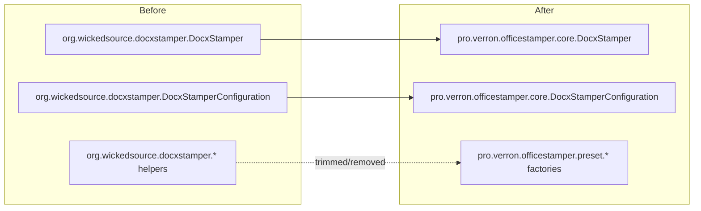
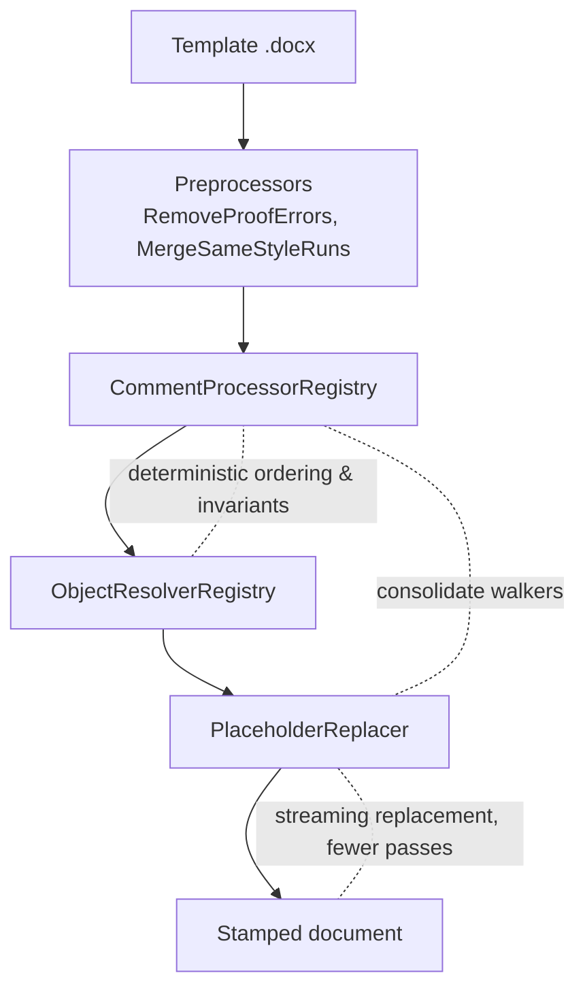

Sustainable agility depends on boundaries you can explain and defend. This month I drew those boundaries explicitly,
codifying the intent I first shared
in [Package contracts as code](/office-stamper/2024/05/01/monthly-commit-package-contract-as-code.html).

I introduced an `engine` module, moved public entry points into intention‑revealing packages, and removed legacy shims.
The goal is clear seams: a stable extension surface for adopters, and a refactor‑friendly space in the core where I can
fix long‑standing design issues without surprising users.

## Why now?

A run of small but telling frictions piled up: PRs that had to thread through unrelated internals, reviewers
second‑guessing where a class “should live,” and extension points that leaked too much of the engine’s shape. Those are
symptoms of missing boundaries.

The 2.0 push is my answer, and it’s made possible by the foundation we laid in 2023 when
we [leveled up the toolchain to Java 17 and JUnit 5](/office-stamper/2023/03/01/monthly-commit-level-up-toolchain.html).
With a modern runtime and test stack, I can now use records and modularity to enforce the boundaries I need.

## Highlights

- Split project into `engine/` and `examples/` ([6bbcd21](https://github.com/verronpro/office-stamper/commit/6bbcd21)),
  with a dedicated `engine/pom.xml` ([45d6fb8](https://github.com/verronpro/office-stamper/commit/45d6fb8)).
- Moved `DocxStamper` to
  `pro.verron.officestamper.core` ([bfa7877](https://github.com/verronpro/office-stamper/commit/bfa7877)).
- Moved `DocxStamperConfiguration` likewise; removed its
  deprecation ([5cb94a1](https://github.com/verronpro/office-stamper/commit/5cb94a1)).
- Bumped the engine to `2.0-SNAPSHOT` to signal a new
  baseline ([592bd73](https://github.com/verronpro/office-stamper/commit/592bd73)).
- Deleted deprecated types that only existed as transitional shims:
  `AbstractToTextResolver` ([022679](https://github.com/verronpro/office-stamper/commit/022679)),
  `LegacyFallbackResolver` ([7f88ebf](https://github.com/verronpro/office-stamper/commit/7f88ebf)), `StampTable` in the
  legacy package ([7cb6a38](https://github.com/verronpro/office-stamper/commit/7cb6a38)), `CommentUtil` and
  `CommentWrapper` ([51e6eb7](https://github.com/verronpro/office-stamper/commit/51e6eb7), [2acb655](https://github.com/verronpro/office-stamper/commit/2acb655)),
  `Image` duplicate in the legacy path ([800d581](https://github.com/verronpro/office-stamper/commit/800d581)), and the
  `UnresolvedExpressionException` that duplicated
  `OfficeStamperException` ([dc83706](https://github.com/verronpro/office-stamper/commit/dc83706)).

## Intention‑revealing namespaces

- `pro.verron.officestamper.core.*` is the safe workspace. I will refactor here aggressively to repair inner‑algorithm
  debts (parser/walker invariants, placeholder replacement, resolver composition). Nothing here is a promise of
  stability.
- `pro.verron.officestamper.preset.*` is where I offer stable, batteries‑included factories and helpers:
  `OfficeStampers`, `OfficeStamperConfigurations`, `Resolvers`, etc. Prefer these unless you are consciously extending.
- Legacy `org.wickedsource.docxstamper.*` remains only where necessary for compatibility and will continue to shrink.



## Migration notes (old → new)

- Imports:
    - `org.wickedsource.docxstamper.DocxStamper` → `pro.verron.officestamper.core.DocxStamper`
    - `org.wickedsource.docxstamper.DocxStamperConfiguration` → `pro.verron.officestamper.core.DocxStamperConfiguration`
- Prefer preset factories:
    - `pro.verron.officestamper.preset.OfficeStampers` (entry points)
    - `pro.verron.officestamper.preset.OfficeStamperConfigurations` (sane defaults)

Example before/after

```java
// before

import org.wickedsource.docxstamper.DocxStamper;
// after
import pro.verron.officestamper.core.DocxStamper;
```

> Craftsmanship notes: stability where users live, freedom where I work
> The main drive behind the reorganization is to keep your adoption cost low while giving me room to improve the
> algorithm. The preset package is the "stable handle." The core is the "workbench." By declaring those intentions in
> the names, I can change internals without stealth breaks, and you can write code that ages more gracefully.

### What I removed, and why it helps

- Deprecated adapters and duplicates masked the true extension surface. Removing them shrinks the cognitive load and the
  chance of misuse under time pressure.
- Examples: `LegacyFallbackResolver` now cleanly maps to `Resolvers.fallback()`; the duplicate `Image` and `StampTable`
  live under `preset.*`; the custom `UnresolvedExpressionException` collapsed into the standard
  `OfficeStamperException`.

### Evidence and risk mitigation

- The full test suites continue to run green after the reorg. Mutation testing levels did not materially change, which
  is a useful proxy that semantics stayed in place while types moved.
- The examples module compiles and runs against the same surface you should use in
  production ([f8dc1f0](https://github.com/verronpro/office-stamper/commit/f8dc1f0), [b5fd710](https://github.com/verronpro/office-stamper/commit/b5fd710)).
- CI and local builds now verify the module graph and public exports (`module-info.java` updates
  in [5cb94a1](https://github.com/verronpro/office-stamper/commit/5cb94a1)).

How the engine works today (and where I’m heading)



Planned inner‑algorithm changes in `core` focus on invariants and passes:

- One pass over the document tree, with an explicit, testable contract for “what a processor can change.”
- Deterministic resolver composition with fewer surprises when multiple resolvers overlap.
- Better separation between parsing, decision, and rendering stages to unblock future features (e.g., smarter table
  handling).

For adopters

- If you only stamp documents (no custom processors), migrate imports and switch to the preset factories. That's usually
  a search‑replace.
- If you extend the library, do it consciously against `preset` and `api` contracts; open issues if you find a seam
  missing.
- If you maintain downstream extensions, validate against `2.0-SNAPSHOT` early and report friction while the surface is
  still being stabilized.

Next

- Stabilize the 2.0 public surface and expand migration snippets for common scenarios.
- Continue trimming legacy exports from `module-info.java` as presets cover more cases.
- Publish characterization tests for the stamping pipeline so future changes in `core` stay honest.

References

- Commits around 2024‑05‑14 →
  2024‑05‑17: [6bbcd21](https://github.com/verronpro/office-stamper/commit/6bbcd21), [45d6fb8](https://github.com/verronpro/office-stamper/commit/45d6fb8), [bfa7877](https://github.com/verronpro/office-stamper/commit/bfa7877), [5cb94a1](https://github.com/verronpro/office-stamper/commit/5cb94a1), [592bd73](https://github.com/verronpro/office-stamper/commit/592bd73), [dc83706](https://github.com/verronpro/office-stamper/commit/dc83706), [800d581](https://github.com/verronpro/office-stamper/commit/800d581), [7cb6a38](https://github.com/verronpro/office-stamper/commit/7cb6a38), [7f88ebf](https://github.com/verronpro/office-stamper/commit/7f88ebf), [022679](https://github.com/verronpro/office-stamper/commit/022679).
