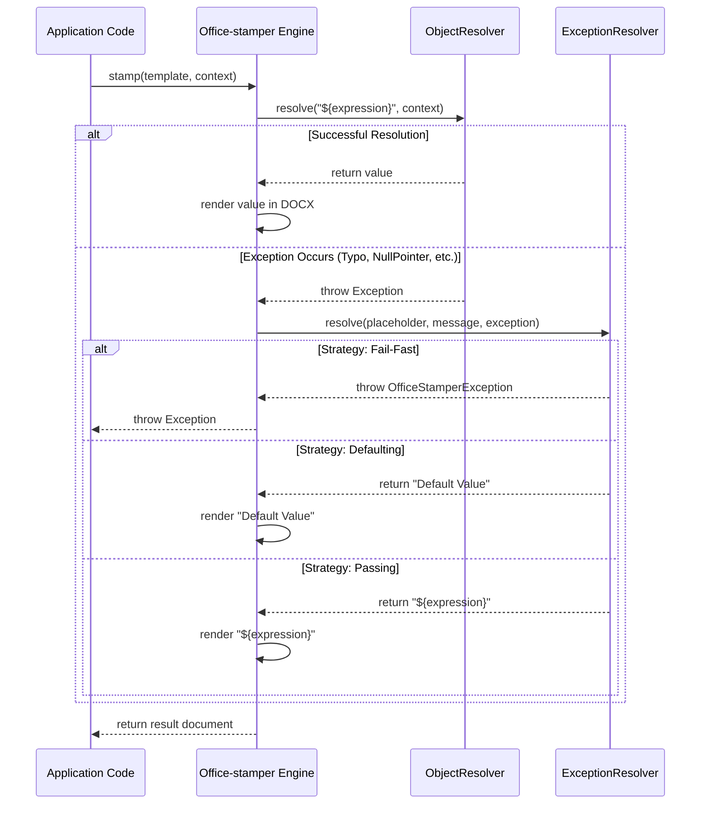

In document automation, your templates are more than just layouts; they are the contract between your data and your users. When a template contains `${invoice.total}` or `${image(customer.photo)}`, you are making a promise that the engine can fulfill that request.

But what happens when the data is missing? What if `customer.photo` is `null`, or the `invoice` object itself is absent? In a solo-maintained project serving large enterprises, these "edge cases" are actually the norm. Unpredictable failures lead to broken documents, midnight support threads, and lost trust.

To address this, we've refined the inner workings of Office‑stamper to move from "accidental" error handling to an explicit, strategy-based architecture. This continues the "Make Implicit Explicit" journey we started in 2023 when we [removed Lombok and clarified our API contracts](/office-stamper/2023/08/15/monthly-commit-remove-lombok-and-clarify-contract.html).

## Principles for Safe Resolvers

Before looking at the code, we must establish the invariants that make a resolver "safe":

1.  **Be explicit about absence**: Don’t overuse `null`. Use Java’s `Optional` at method boundaries to signal that a value might be missing.
2.  **Separate detection from rendering**: First decide if you *can* handle a value, then decide *how* to render it.
3.  **Fail fast at configuration boundaries**: If a function name is misspelled, tell the user immediately during development, not at runtime in production.
4.  **Provide smart, minimal defaults**: If a value is missing, decide on a consistent policy: render nothing, render a placeholder (e.g., "—"), or stop the process.

## The Evolution: From Error Handlers to ExceptionResolvers

Initially, Office‑stamper used a relatively rigid `OfficeStamperErrorHandler`. While functional, it was hard to discover and difficult to extend for complex recovery strategies.

In our latest refactor, we introduced the `ExceptionResolver` interface. This functional interface decouples the *occurrence* of an error from the *strategy* used to resolve it.

```java
@FunctionalInterface
public interface ExceptionResolver {
    String resolve(Placeholder placeholder, String message, Exception cause);
}
```

This change allows users to programmatically select their failure management strategy in a discoverable way. For example, you can now implement a strategy that prompts a user for missing values or logs the error to a specialized monitoring system.

## Strategies in Action: Fail-Fast vs. Soft-Fail

Through the `OfficeStamperConfiguration`, you can now explicitly choose how the engine reacts to expression errors:

### 1. The Fail-Fast Strategy (`ThrowingResolver`)
This is my personal recommendation for CI/CD and development. It throws an `OfficeStamperException` at the first sign of trouble.
**Why?** It forces you to solve the root cause—be it a typo in the template or a bug in the data provider—as soon as possible.

### 2. The Soft-Fail Strategy (`DefaultingResolver` / `PassingResolver`)
Business users often prefer a "graceful" failure.
- **Defaulting**: Replaces the failed expression with a fixed string (like an empty string or "N/A").
- **Passing**: Leaves the original expression (e.g., `${unresolved.variable}`) in the document, making it easy to spot where the data is missing without breaking the layout.

## Worked Example: The Appendix Strategy

In high-stakes enterprise documents, a silent "N/A" might not be enough. You might want to point the reader to an audit trail at the end of the document. By implementing a custom `ExceptionResolver`, you can collect all failed resolutions and return a reference code instead.

```java
public class AppendixCollectingResolver implements ExceptionResolver {
    private final List<ResolutionError> errors = new ArrayList<>();

    @Override
    public String resolve(Placeholder placeholder, String message, Exception cause) {
        int id = errors.size() + 1;
        errors.add(new ResolutionError(id, placeholder.expression(), message));
        return "[A-" + id + "]"; // Replaces ${field} with [A-1], [A-2], etc.
    }
}
```

In your Word template, you can then have a section titled **Appendix A: Unresolved Data Audit** that uses a `repeatTableRow` processor to list all the collected errors. This way, the document is both readable and technically complete.

## Visualizing the Flow

The following sequence diagram illustrates how Office‑stamper handles the resolution journey, from the initial expression to the final rendered text, including the new exception resolution hook.



## The Solo-Maintainer Edge

As a solo maintainer, my throughput depends on the system being self-documenting. Previously, users would often ask: *"Where are the logs for this failed expression?"* 

By making the `ExceptionResolver` an explicit part of the programmatic setup, the behavior is now visible in the code itself. There is no "hidden" logging logic or "magic" null handling. You see the resolver in your configuration, and you know exactly what will happen when a placeholder fails.

This explicitness reduces support overhead and empowers enterprise teams to build their own recovery logic—such as a resolver that triggers a manual data-entry step when a mandatory field is missing.

## Pitfalls and Mitigations

- **Silent Data Loss**: Soft-fail modes can hide legitimate data issues. **Mitigation**: Use `ThrowingResolver` in your test environment and only switch to `DefaultingResolver` in production if strictly necessary.
- **Over-reliance on Defaults**: If every error returns an empty string, debugging becomes a nightmare. **Mitigation**: Always ensure your `ExceptionResolver` logs a `WARN` or `ERROR` even if it returns a default value.

## Checklist for Resilient Templates

1.  **Audit your data objects**: Are you using `Optional` for fields that might be absent?
2.  **Choose your strategy**: Use `.setFailOnUnresolvedExpression(true)` in development.
3.  **Implement custom resolvers**: If you have domain-specific error handling (e.g., "See Appendix A" for missing details), implement a custom `ExceptionResolver`.
4.  **Test the "Missing" Case**: Add a test fixture where the context object is empty. If the engine doesn't behave as expected, adjust your `ExceptionResolver`.

Robustness isn't about avoiding errors; it's about making them predictable and manageable. With `ExceptionResolver`, Office‑stamper gives you the tools to fulfill that promise.
